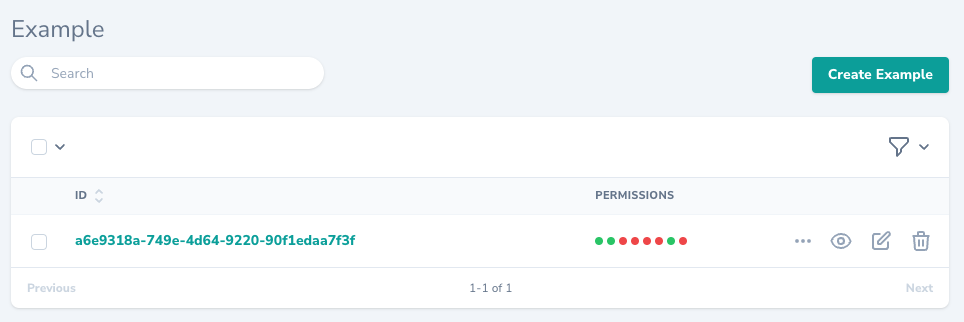

# Nova Percent Field

[](https://packagist.org/packages/idez/nova-checkboxes-field)
[](https://packagist.org/packages/idez/nova-checkboxes-field)
[](https://packagist.org/packages/idez/nova-checkboxes-field)

## About

This is a custom field of checkboxes from Laravel Nova 4.

## Requirements

-   `php: ^7.3|^8.0|^8.1`
-   `laravel/nova: ^4.0`

## Installation

To install this checkboxes field run the following command in your Laravel Nova 4 project:

```bash
composer require idez/nova-checkboxes-field
```

## Usage

### Default usage

Using a `key => value` array as options.

```php
use Idez\NovaCheckboxesField\Checkboxes;
use Laravel\Nova\Http\Requests\NovaRequest;

class CustomResource extends Resource
{
    public function fields(NovaRequest $request): array
    {
        $permissions = [
            'user.list' => 'List users',
            'user.create' => 'Create user',
            'user.edit' => 'Edit users',
            'user.delete' => 'Delete users',
            'post.list' => 'List posts',
            'post.create' => 'Create posts',
            'post.edit' => 'Edit posts',
            'post.delete' => 'Delete posts',
        ];

        return [
            Checkboxes::make('Permissions', 'permissions')
                ->options($permissions),
        ];
    }
}
```




### Grouping checkboxes

Using a multi-dimensional array you can group your checkboxes.

```php
use Idez\NovaCheckboxesField\Checkboxes;
use Laravel\Nova\Http\Requests\NovaRequest;

class CustomResource extends Resource
{
    public function fields(NovaRequest $request): array
    {
        $permissions = [
            'Users' => [
                'user.list' => 'List users',
                'user.create' => 'Create user',
                'user.edit' => 'Edit users',
                'user.delete' => 'Delete users',
            ],
            'Posts' => [
                'post.list' => 'List posts',
                'post.create' => 'Create posts',
                'post.edit' => 'Edit posts',
                'post.delete' => 'Delete posts',
            ],
        ];

        return [
            Checkboxes::make('Permissions', 'permissions')
                ->options($permissions)
                ->withGroups(),
        ];
    }
}
```


## Contributing

Contributions are welcome, explain the issue/feature that you want to solve/add and back your code up with tests. Happy coding!

## License

This checkboxes features was originally developed by https://github.com/eminiarts/nova-permissions however they have abandoned the package.
The MIT License (MIT). Please see [License File](LICENSE) for more information.
